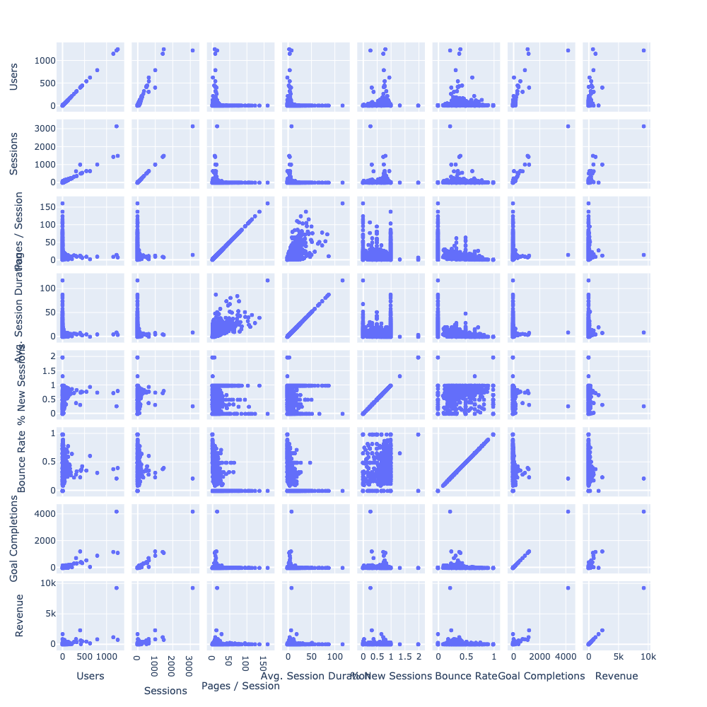
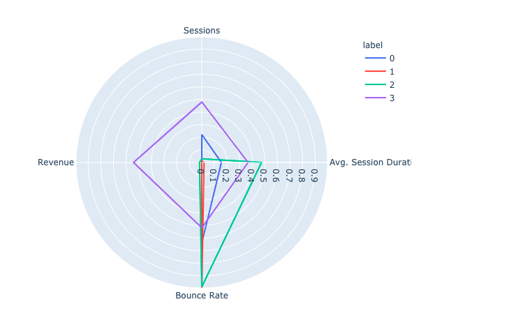
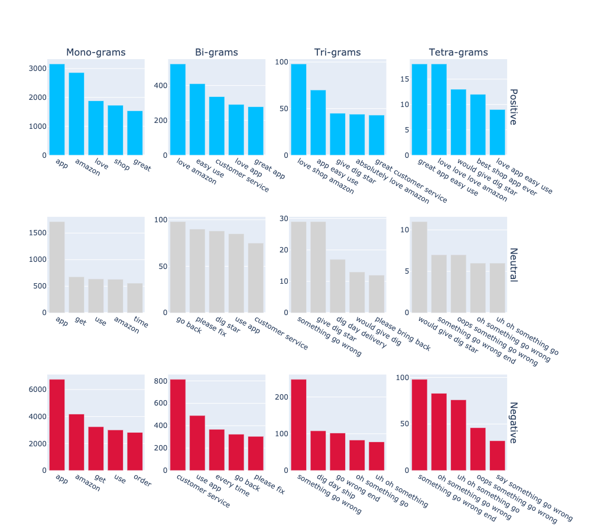
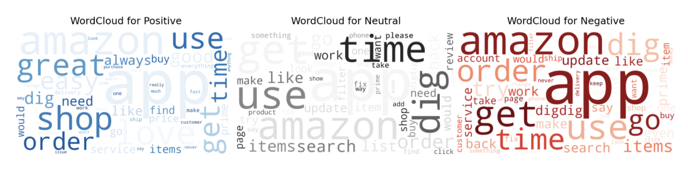
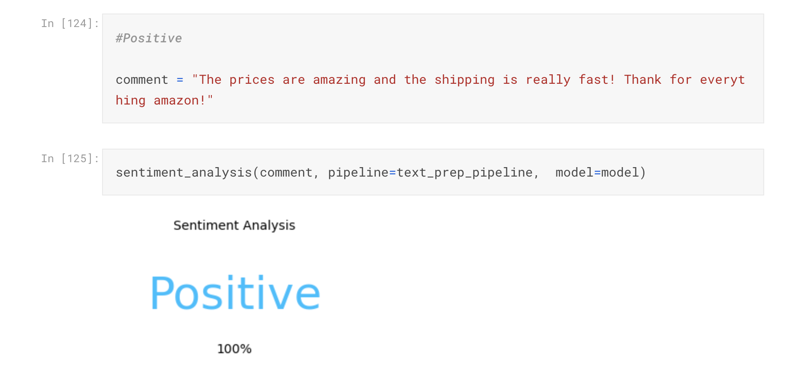
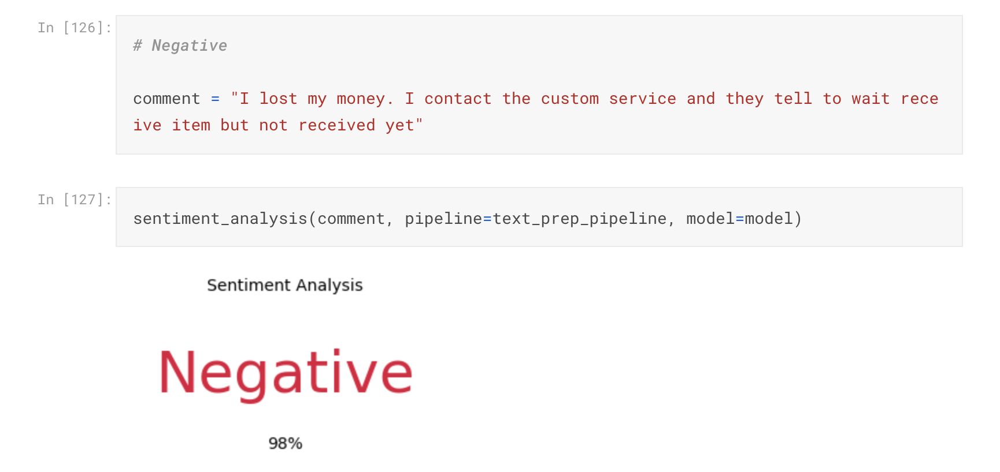
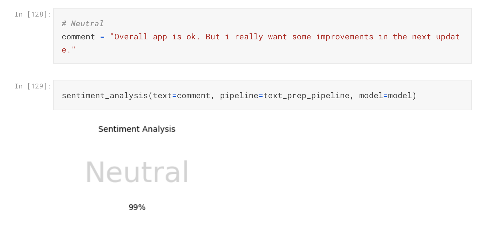
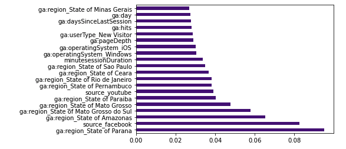
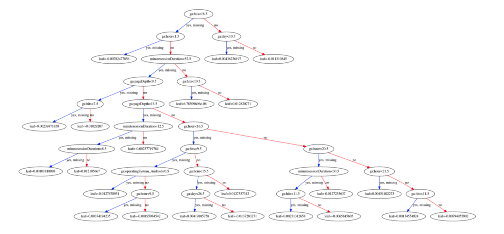
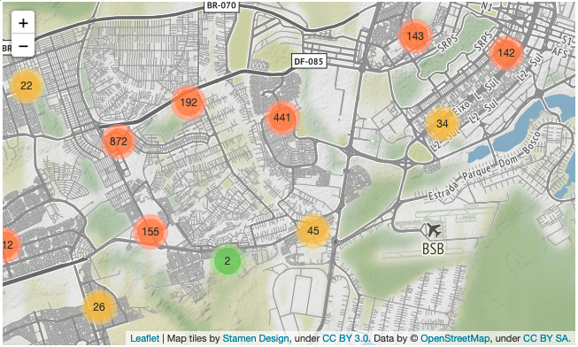

## **About Me**

In 2016 I created my first **ecommerce** and I had my first contact with Web Analysis. Searching how to bring more users for my website I got to know pay-per-click advertising and I became a Google Partner specialist on it. So, I created the **bloco-b** that started providing **PPC** services and web analysis all over Brazil. Now, I am getting into **Data Science** and **Machine Learning** looking for better results for the clients of **bloco-b**.
 
 

## **Personal Projects**

In my personal projects I was always looking to bring some kind of value for my personal business. For that reason, most of my projects are related to websites informations, predictions or insights.
The projects are the following:  

## **Google Ads - Search Queries Clustering**

* Tested 4 different cluster algos to choose and label the **Search Queries** with the most meaningful cluster model based on the users **online behavior** to help online businesses to reduce costs in their campaigns.
* The data was exported from **Google Analytics**.
* Preprocessed the data before de modeling analysing the correlation of the features and normalizing them.
* Specified the number of clusters using **silhouette score** for each of the cluster algos.
* Was tested the following cluster algos: **K Means, Spectral Clustering, Agglomerative Clustering, Gaussian Mixture.**

 
 
 

###### [Github Repositore](https://github.com/varelaerick/GAds-Search-Queries-Clustering) | [Kaggle Kernel](https://www.kaggle.com/erickvarela/google-ads-search-queries-clustering)
 
 

## **Sentiment Analyse + Deep Learn - Amazon Shopping App Reviews**

* Created a **Sentiment Analysis** with **Deep Learning** to recognise a sentiment in a text.
* Scraped over 3000 reviews for **Google Play Store** and **App Store** using APIs 
* Built a pipeline that **text preprocessing** the reviews and to bring them to  a form that is predictable and analyzable for the **neural network**.
* Converted text inputs into embedded vectors using Global Vectors For Word (**GloVe**)
* Built a sentiment analysis using keras modules **Model , Dense, LSTM** and **Embedding.**

 

 
 
 

###### [Github Repositore](https://www.kaggle.com/erickvarela/sentiment-analyse-deep-learn-amazon-app) | [Kaggle Kernel](https://www.kaggle.com/erickvarela/google-ads-search-queries-clustering)
 
 

## **Google Analytics API - Ecommerce - Exploratory Data Analysis**

* Was built an exploratory analysis to get different insights about each of the traffic mediums of ecommerce.
* The data was extracted using the **Google Analytics API**.
* Splitting the data set into traffic mediums and running the functions though each data set to explore the transactions, getinsights of the buyers profile, buyer behavior and checking the correlation between our features and transaction, we are going to have a good understanding of them.
* Using descriptive statistics we are going to present inferences about of each traffic medium
* In the end we will present a clear conclusion section that presents the main differences & patterns of each traffic medium and find a hypothesis to be tested in further projects to improve the user experience in ecommerce. 

 

 

###### [Github Repositore](https://github.com/varelaerick/Google-Analyts-API-Ecommerce-Exploratory-Data-Analysis) | [Kaggle Kernel](https://www.kaggle.com/erickvarela/ga-api-ecommerce-exploratory-analysis)
 
 

## **Google Analytics-API - Ecommerce - Binary Classification - Transactions Predictor**

* **Tested 42 different methods** to predicate the transaction, tune the best method and plot the decision tree
* Four functions were built to split the dfs in train and test. Raw split, without zeros (without bounce rate), without outliers, without zeros and outliers.
 * Also was built three functions for the **Resampling Strategies**. **Random Under Sample**, **Random Over Sample** and **Tomek Links**. 
* Then, the main function was built  that tested all these variations into three different classification algos: **DecisionTreeClassifier**, **RandomForestClassifier**, **Extreme Gradient Boosting**. 
* Using **Hyperopt** i will tune the best model found by the previous function of each traffic medium and plot the feature importance and the best decision tree.

 

 

###### [Github Repositore](https://github.com/varelaerick/Google-Analytics-API-Ecommerce-Binary-Classification-Transactions) | [Kaggle Kernel](https://www.kaggle.com/erickvarela/ga-api-classification-ecommerce-transactions)
 
 

## **Data Cleaning - Price Predictor - Brasília Apartments**

* Created a predictor that estimates the Brasilia apartments prices to help buyers and sellers to deal
* **Scraped** over 3000 apartments for sale from Vila Real using **python** and **selenium**
* Engineered features from the address filled by the sellers, to get the address, neighborhood and the AR (administrative region) correctly returned by the **Correios API**.
* Built a pipeline that optimized **Lasso, KernelRidge, Elastic Net, XGBRegressor** and **LGBRegressor** using **GridsearchCV** to reach the best model.

 

###### [Github Repositore](https://www.kaggle.com/erickvarela/price-prediction-brasilia-apartments) | [Kaggle Kernel](https://www.kaggle.com/erickvarela/ga-api-classification-ecommerce-transactions)

