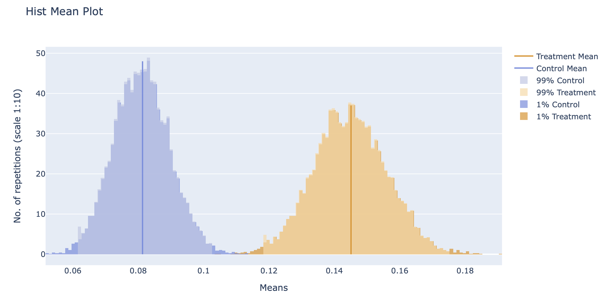
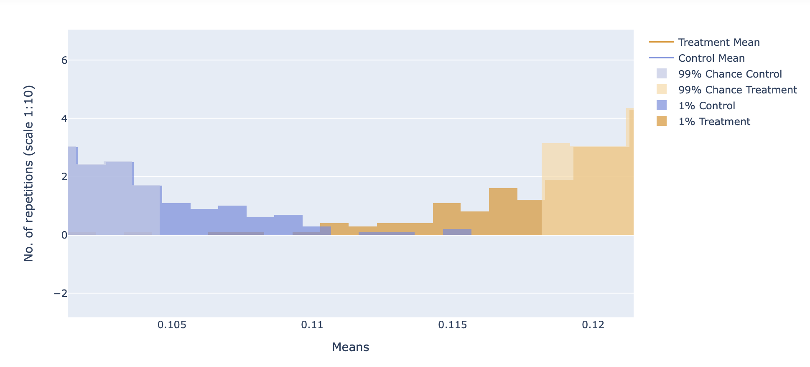
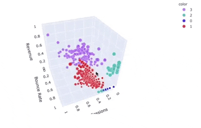
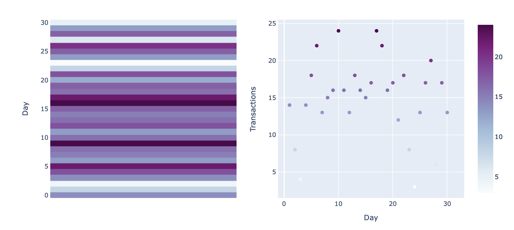
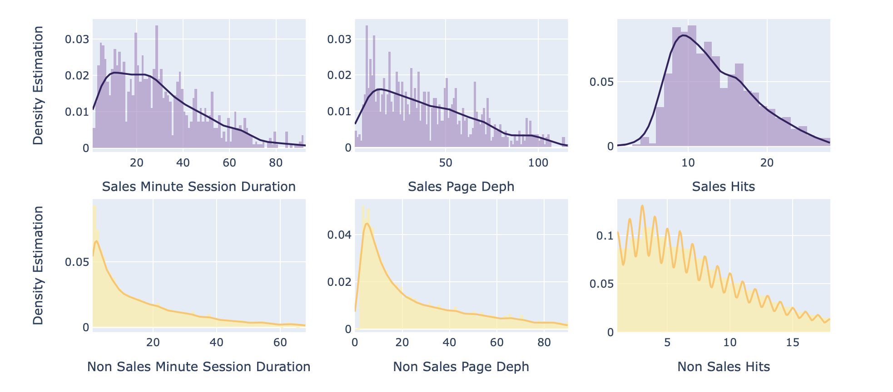

 
 

## **About Me**

In 2016, I created my first ecommerce store and had my first interaction with web analysis. By searching how to bring more users to my website, I got to know the ins and outs of Pay-Per-Click (PPC) advertising, and I became a Google Partner specialist on it. So, I founded the Bloco-b that started providing PPC services and web analysis all over Brazil. Since 2019, I have been studying Data Analytics and Data Science, doing projects related to my background experiences. Now I’m seeking to make the web a better place with machine learning creative finds.
 
 
 

## **Personal Projects**

I’m always looking to bring some value to online businesses somehow. For that reason, my projects are related to website data, predictions, or insights. The projects are the following:
 
 
### **Query-Boost - Beta Version**
* In 2021, I improved and deployed the **Google Ads - Search Queries Clustering** project.
* I created an MVP that is currently being validated.
* In this project, I got a lot of practical experience creating one start-up and programming.
*  The main programming languages were: **Python, JavaScript, HTML**, and **CSS**.
* I put in use mainly **Flask**, **My SQL**, **Heroku**, and **Google Cloud** services like **Google Analytics API**, **Google Sheets API**, **Google Login**, and more.
* To see more about the application, you can watch the video below or visit the website.
 
 

<iframe width="560" height="315" src="https://www.youtube.com/embed/uXS5vDhJZN0" title="YouTube video player" frameborder="0" allow="accelerometer; autoplay; clipboard-write; encrypted-media; gyroscope; picture-in-picture" allowfullscreen></iframe>

 
 
#### [Query-Boost.com](https://quey-boost.com/)

### **A/B testing - Page Speed x Conv. Rate**
* I elaborated and run that A/B test is to evaluate if a change in load speed also improved performance in the conversion rate.
* I designed the experiment and chose sample statistically significant with: **Statsmodels**, **Math** and **Scipy.stats**.
* Using a sample with 1007 sessions, we reject the null hypothesis with 99% of confidence with a z-scores: -4.50 p-value: 0.0000067659
* Resampling with Bootstrapping technique and plot all the results with **Plotly**
 
 
#### [Github Repositore](https://github.com/varelaerick/A-B-testing-PageSpeed_x_Conv-Rate) 

  

 
 

### **Google Ads - Search Queries Clustering**
* I tested four different algorithms to label search queries based on the user’s online behavior to help online businesses reduce costs in their campaigns.
* The four different clusters were: **K Means**, **Spectral Clustering**, **Agglomerative Clustering**, **Gaussian Mixture**.
* Specified the number of clusters using **Silhouette Score** for each clustering algorithm.
* All algorithms showed promising results, but the most important was finding the most meaningful cluster. We choose the **Gaussian Mixture** for some reasons detailed in section 9 - The Best Choice.
 
 
#### [Github Repositore](https://github.com/varelaerick/GAds-Search-Queries-Clustering) | [Kaggle Kernel](https://www.kaggle.com/erickvarela/google-ads-search-queries-clustering)

  

 

 
 
## **Sentiment Analyse + Deep Learn - Amazon Shopping App Reviews**

* I Scraped over 3,000 reviews from **Google Play Store** and **App Store** using APIs
* I Built a pipeline that uses Text Preprocessing to bring the reviews to a form that is predictable and analyzable for the **Neural Network**.
* I also built a sentiment analysis using Keras modules **Model** , **Dense**, **LSTM** **and Embedding**.
* In the end, I built a function that applies the pipeline for text preprocessing, classifies a comment with the model, and tells us if the comment is **Positive**, **Negative** **or Neutral**.
* The result reached by my model in the test data set was - Loss 0.60 - Accuracy 0.74 - Prediction 0.75 - Recall 0.73 - F1-Score 074.
 
 
#### [Github Repositore](https://github.com/varelaerick/Sentiment-Analyse-Deep-Learn-Amazon-App) | [Kaggle Kernel](https://www.kaggle.com/erickvarela/sentiment-analyse-deep-learn-amazon-app)

 

 
 

 
 
### **Data Cleaning - Price Predictor - Brasília Apartments**

* I **scraped** over 3,000 apartments for sale from the Vila Real website using **BeautifulSoup** and **Selenium**.
* I spend a few steps in Feature engineering with Pandas.
* I created a pipeline that also tuned the parameters based on cross-validation using **Grid Search**
* The **pipeline** also tested the **Regression Algorithms Lasso (l1), Kernel Ridge (l2), Elastic NNet, Xgb Regressor, or Lgbm Regressor.** 
* The model chosen by the pipeline was XGBRegressor and achieved Rˆ2 - 0.83 in the data set test.
 
 
#### [Github Repositore](https://github.com/varelaerick/Price-Predictor-Bras-lia-Apartments) | [Kaggle Kernel](https://www.kaggle.com/erickvarela/price-prediction-brasilia-apartments)

 

 
 

### **Google Analytics API - Ecommerce - Exploratory Data Analysis**

* I built an Exploratory Data Analysis to get different insights about each traffic medium of eCommerce.
* The data was extracted using the **Google Analytics API** and split based on the traffic medium of the website. **Google Analytics API**.
* With the analysis, we can recognize patterns and differences between the traffic mediums.  
* Also, I found a hypothesis to be tested. That Android users, who are New Visitors, are having problems with the page loading speed and mobile usability of the site raising the website's Bounce Rate.
* A Kaggle user recently commented on the project, and the code needs adjustments.

 
 
#### [Github Repositore](https://github.com/varelaerick/Google-Analyts-API-Ecommerce-Exploratory-Data-Analysis) | [Kaggle Kernel](https://www.kaggle.com/erickvarela/ga-api-ecommerce-exploratory-analysis)

 

 

 
 
### **Google Analytics-API - Ecommerce - Binary Classification - Transactions Predictor**

* **I Tested 42 different methods** to predicate the transaction, tune the best method and plot the decision tree
* I built four functions to split the dfs in train and test. Raw split, without zeros (without bounce rate), outliers, and zeros and outliers.
* Also, I built three functions for the **Resampling Strategies**. **Random Under Sample**, **Random Over Sample**, and **Tomek Links**. 
* Then, the primary function was built, which tested all those variations into three different classification algorithms: **DecisionTreeClassifier**, **RandomForestClassifier**, **Extreme Gradient Boosting**. 
* I Used **Hyperopt** to tune the best model of each traffic medium and plot the feature importance and the best decision tree.
* That was my first project. I learned a lot more so far, and now I regret many things, haha.
 
 
#### [Github Repositore](https://github.com/varelaerick/Google-Analytics-API-Ecommerce-Binary-Classification-Transactions) | [Kaggle Kernel](https://www.kaggle.com/erickvarela/ga-api-classification-ecommerce-transactions)

 

 
 

