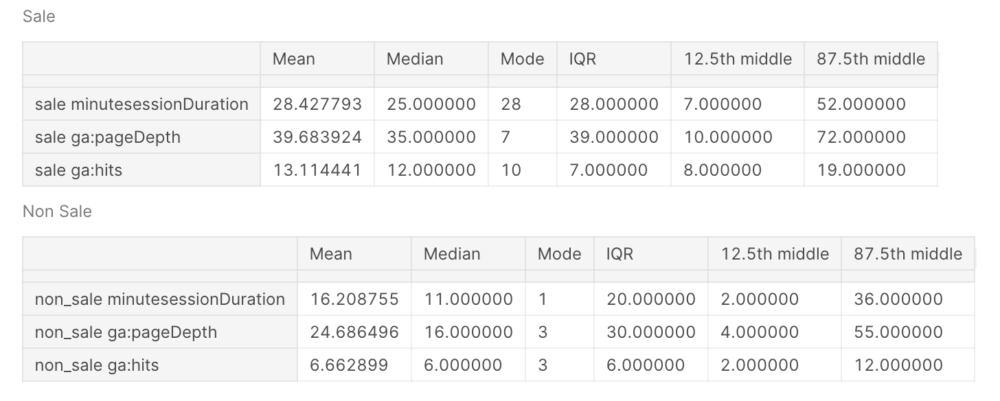

 
 

## **About Me**

In 2016 I created my first ecommerce and I had my first contact with Web Analysis. Searching how to bring more users for my website I got to know Pay-Per-Click (PPC) advertising and I became a Google Partner specialist on it. So, I founded the b-block that started providing PPC services and Web Analysis all over Brazil. Since 2019, I am studying Data Analytics and Data Science doing projects correlated with my background experiences, looking to bring value for my business, new knowledge and great finds.
 
 
 

## **Personal Projects**

In my personal projects I was always looking to bring some kind of value for my business. For that reason, most of my projects are related to websites data, predictions or insights.
The projects are the following:
 
 

### **Google Ads - Search Queries Clustering**
* I tested 4 different cluster somethings to label the **Search Queries** based on the users Online Behavior to help online businesses to reduce costs in their campaigns.
* The 4 different cluster somethings were: **K Means**, **Spectral Clustering**, **Agglomerative Clustering**, **Gaussian Mixture**.
* Specified the number of clusters using **Silhouette Score** for each of the cluster algos.
* All of the algorithms show very good results, but the most important thing was to find the most meaningful cluster. We choose the **Gaussian Mixture** for some reasons, detailed in section 9 - The Best Choice.
* The project is currently being deployed in a web application.
 
 
#### [Github Repositore](https://github.com/varelaerick/GAds-Search-Queries-Clustering) | [Kaggle Kernel](https://www.kaggle.com/erickvarela/google-ads-search-queries-clustering)

  

 

 
 
## **Sentiment Analyse + Deep Learn - Amazon Shopping App Reviews**

* Scraped over 3000 reviews for **Google Play Store** and **App Store** using APIs
* Built a pipeline that Text Preprocessing to bring the reviews  to a form that is predictable and analyzable for the **Neural Network**.
* Built a sentiment analysis using Keras modules **Model** , **Dense**, **LSTM** **and Embedding**.
* Finally, I built a function that applies the pipeline for text preprocessing, classifies a comment with the model and returns if the comment is **Positive**, **Negative** **or Neutral**.
* The result reached by my model in the test data set was - Loss 0.60 - Accuracy 0.74 - Prediction 0.75 - Recall 0.73 - F1-Score 074.
 
 
#### [Github Repositore](https://github.com/varelaerick/Sentiment-Analyse-Deep-Learn-Amazon-App) | [Kaggle Kernel](https://www.kaggle.com/erickvarela/sentiment-analyse-deep-learn-amazon-app)

 

 
 

 
 
### **Data Cleaning - Price Predictor - Brasília Apartments**

* I **Scraped** over 3000 apartments for sale from the Vila Real website using **BeautifulSoup** and **Selenium**.
Spend a few steps in Feature engineering with Pandas.
* I created a pipeline that also tuned the parameters based on a cross validation using **Grid Search**
* The **pipeline** also tested the **Regression Algorithms Lasso (l1), Kernel Ridge (l2), Elastic NNet, Xgb Regressor or Lgbm Regressor.** 
* The model chosen by the pipeline was XGBRegressor and achieved Rˆ2 - 0.83 in the data set test
 
 
#### [Github Repositore](https://github.com/varelaerick/Price-Predictor-Bras-lia-Apartments) | [Kaggle Kernel](https://www.kaggle.com/erickvarela/price-prediction-brasilia-apartments)

 

 
 

### **Google Analytics API - Ecommerce - Exploratory Data Analysis**

* I built an exploratory analysis to get different insights about each of the traffic mediums of ecommerce.
* The data was extracted using the **Google Analytics API**. and splitted based on the traffic medium of the website. 
* With the analysis we are able to recognize patterns and differences between the traffic mediums.
* Also find a hypotese to be tested. Maybe the Android users that are New Visitor are having problems with the page loading speed and mobile usability of the site raising the Bounce Rate of the website.
* The project was recently commented on Kaggle and the code needs a adjustments.

 
 
#### [Github Repositore](https://github.com/varelaerick/Google-Analyts-API-Ecommerce-Exploratory-Data-Analysis) | [Kaggle Kernel](https://www.kaggle.com/erickvarela/ga-api-ecommerce-exploratory-analysis)

 

 

 
 
### **Google Analytics-API - Ecommerce - Binary Classification - Transactions Predictor**

* **Tested 42 different methods** to predicate the transaction, tune the best method and plot the decision tree
* Four functions were built to split the dfs in train and test. Raw split, without zeros (without bounce rate), without outliers, without zeros and outliers.
* Also was built three functions for the **Resampling Strategies**. **Random Under Sample**, **Random Over Sample** and **Tomek Links**. 
* Then, the main function was built  that tested all these variations into three different classification algos: **DecisionTreeClassifier**, **RandomForestClassifier**, **Extreme Gradient Boosting**. 
* I Used **Hyperopt** to tune the best model of each traffic medium and plot the feature importance and the best decision tree.
* The code needs a adjustments.
 
 
#### [Github Repositore](https://github.com/varelaerick/Google-Analytics-API-Ecommerce-Binary-Classification-Transactions) | [Kaggle Kernel](https://www.kaggle.com/erickvarela/ga-api-classification-ecommerce-transactions)

 

 
 

